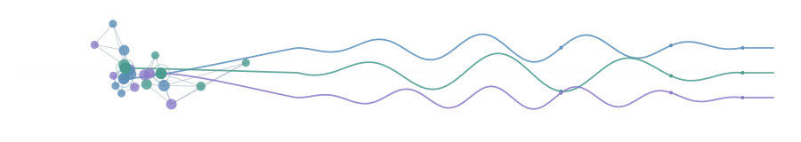

# Zhao Chang

**Ph.D. Student · Department of Physics · Hong Kong Baptist University**

Computational Neuroscience &nbsp;·&nbsp; Complex Brain Networks &nbsp;·&nbsp; Neural Dynamics

<!-- Add when ready:

-->

## About

I am a Ph.D. student in the Department of Physics at **Hong Kong Baptist University**, advised by **Prof. Changsong Zhou**. My research sits at the interface of physics and neuroscience: I use **complex network theory** and **neural dynamics** to understand how structural connectivity shapes functional dynamics in the brain — in health, and in psychiatric disorders such as schizophrenia, bipolar disorder, and ADHD. Before HKBU, I received my M.Sc. in Neuroscience from Xi'an University of Science and Technology.

## Research Focus

| | |
| :-- | :-- |
| 🕸️ &nbsp;**High-order brain networks** | Beyond pairwise connections — what higher-order interactions reveal about shared and distinct features of psychiatric disorders |
| 🔁 &nbsp;**Structure–function coupling** | How anatomical connectivity constrains and predicts functional brain dynamics and cognition |
| ⚖️ &nbsp;**Integration–segregation balance** | Quantifying the network balance that supports healthy cognition, and how it breaks down in disease |
| 🩺 &nbsp;**Clinical network neuroscience** | Resting-state fMRI markers of schizophrenia · bipolar disorder · ADHD |

## Selected Publications

- Wu, D., **Chang, Z.**, et al. (2025). High-order network degree revealed shared and distinct features among schizophrenia, bipolar disorder and ADHD. *Neuroscience*.
- Wang, R., **Chang, Z.**, Liu, X., & Zhou, C. (2025). Weak but influential: Nonlinear contributions of structural connectivity to human cognitive abilities and brain functions. *Preprint*.
- **Chang, Z.**, Wang, X., Wu, Y., et al. (2023). Segregation, integration, and balance in resting-state brain functional networks associated with bipolar disorder symptoms. *Human Brain Mapping*, 44(2), 599–611.
- Wang, X.\*, **Chang, Z.**\*, & Wang, R. (2023). Opposite effects of positive and negative symptoms on resting-state brain networks in schizophrenia. *Communications Biology*. (\* co-first author)

<a href="https://scholar.google.com/citations?user=oW291nUAAAAJ&hl=en">Full list on Google Scholar →</a>

## Projects

| Project | What it is | Built with |
| :-- | :-- | :-- |
| [**PaperSender**](https://github.com/cz-bszy/paper_sender) | Personalized research-paper recommendation app on the OpenAlex catalog — subscriptions by field/topic, feedback-driven ranking, paper Q&A, weekly digests; one codebase for iOS / Android / Web | TypeScript · Expo |
| [**fMRI_Processing**](https://github.com/cz-bszy/fMRI_Processing) | Modular, Bash-orchestrated neuroimaging preprocessing pipeline | Shell |
| [**SNMThresholdPipeline**](https://github.com/cz-bszy/SNMThresholdPipeline) | Threshold selection and sensitivity-analysis pipeline for brain-network construction | Python |

## Toolbox

## GitHub Stats

